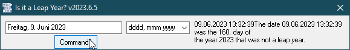

# Date_IsLeapYear
## Calculates if a year is a normal year with 365 days or a leap year with 366 days

Project started in okt 2008  

09.jun.2023: 
The function [IsLeapYear](https://github.com/OlimilO1402/Date_TimeConversion/blob/main/Modules/MTime.bas#L1247) is now part of the module [MTime](https://github.com/OlimilO1402/Date_TimeConversion/blob/main/Modules/MTime.bas) which can be found in the repo [Date_TimeConversion](https://github.com/OlimilO1402/Date_TimeConversion)

